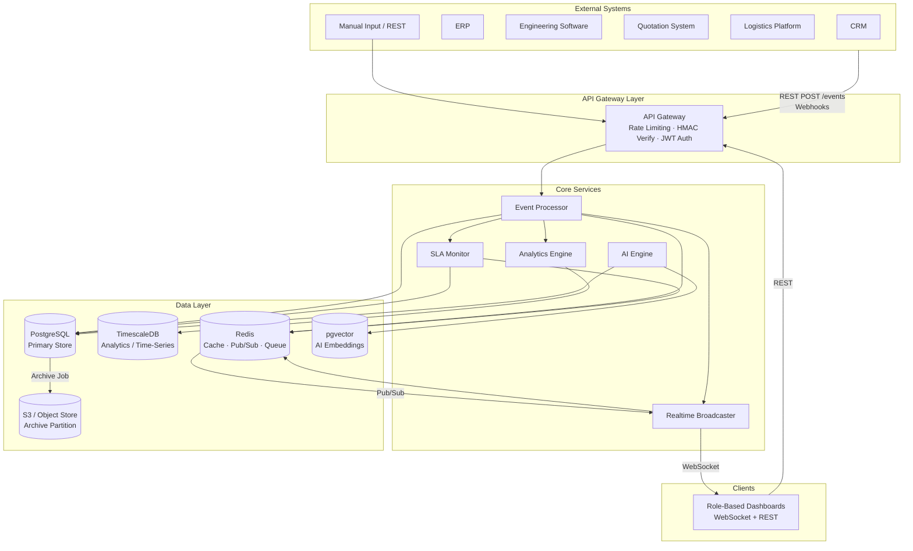
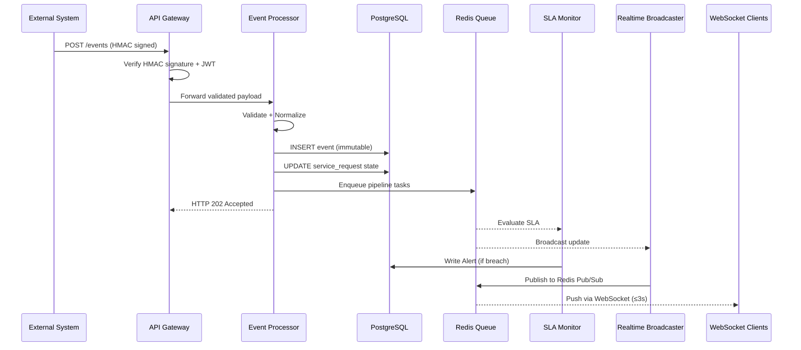

# Design Document

## Dayliff 1000 Eyes — Enterprise Process Observability Platform

---

## Overview

Dayliff 1000 Eyes is a centralized observability layer that sits above existing business applications (CRM, ERP, Engineering Software, Quotation Systems, Logistics Platforms). It ingests events from those systems via REST APIs, webhooks, and scheduled syncs; reconstructs end-to-end customer journeys; monitors SLA compliance in real time; generates alerts; and surfaces insights through role-based dashboards and an AI Operational Copilot.

The platform must handle:
- High-throughput, immutable event ingestion with a 5-second end-to-end processing SLA
- Real-time push delivery to 500+ concurrent WebSocket clients
- Two-tier AI (Level 1: predictive analytics; Level 2: natural language Copilot)
- Indefinite audit trail retention with archival partitioning
- Strict RBAC enforced uniformly across all APIs and dashboard modules

### Design Goals

1. **Correctness over speed** — immutable event store with at-least-once delivery guarantees and idempotency
2. **Low-latency real time** — sub-3-second push from state change to all affected clients
3. **Scalable AI** — decoupled ML inference pipeline with graceful degradation
4. **Auditability** — every mutation traceable to a timestamped, immutable Event record
5. **Role isolation** — RBAC enforced at the data layer, not just the route layer

---

## Architecture

### High-Level Component Diagram



### Request Flow — Event Ingestion



---

## Technology Stack

### Backend

| Concern | Technology | Rationale |
|---|---|---|
| Primary language | **Node.js 20 LTS (TypeScript)** | Non-blocking I/O suits event streaming; large ecosystem for WebSockets and queues |
| HTTP Framework | **Fastify 4** | Higher throughput than Express; built-in schema validation via JSON Schema |
| Task Queue | **BullMQ (Redis-backed)** | Reliable job processing with retries, exponential backoff, and dead-letter queues |
| WebSockets | **ws + uWebSockets.js** | Native performance; integrates with Redis Pub/Sub fan-out |
| ORM / Query | **Drizzle ORM** | Type-safe SQL; supports PostgreSQL and TimescaleDB hypertables |
| Auth | **jose (JWT)** | Standards-compliant JWT signing and verification (RS256) |
| Validation | **Zod** | Runtime schema validation shared between API layer and processing pipeline |

### Data

| Concern | Technology | Rationale |
|---|---|---|
| Primary RDBMS | **PostgreSQL 16** | ACID guarantees for immutable events; row-level security for RBAC data isolation |
| Time-series analytics | **TimescaleDB** (PostgreSQL extension) | Efficient hypertable compression and continuous aggregates for KPI queries |
| Cache / Pub/Sub / Queue | **Redis 7** | Sub-millisecond latency for Pub/Sub fan-out; BullMQ queue backend |
| Vector search | **pgvector** (PostgreSQL extension) | Copilot semantic search over operational data using embeddings |
| Archive | **AWS S3 / MinIO** | Cost-effective object storage for records older than archival threshold |

### AI / ML

| Concern | Technology | Rationale |
|---|---|---|
| Level 1 — Prediction | **Python FastAPI microservice** (scikit-learn / XGBoost) | Mature ML ecosystem; models trained offline and served via REST to the AI Engine |
| Level 2 — Copilot | **LangChain + OpenAI GPT-4o** (or self-hosted LLM via Ollama) | Tool-calling agent that converts NL queries to structured DB queries; scoped by RBAC context |
| Embeddings | **text-embedding-3-small** (or `nomic-embed-text` for self-hosted) | Compact, fast embeddings for semantic intent matching in Copilot |

### Infrastructure

| Concern | Technology |
|---|---|
| Containerization | Docker + Docker Compose (dev); Kubernetes (prod) |
| Reverse Proxy | Nginx / AWS ALB |
| Secrets | HashiCorp Vault / AWS Secrets Manager |
| Observability | OpenTelemetry → Grafana + Loki + Tempo |
| CI/CD | GitHub Actions |

---

## Data Models

### `users`

```sql
CREATE TABLE users (
    id            UUID PRIMARY KEY DEFAULT gen_random_uuid(),
    email         TEXT UNIQUE NOT NULL,
    password_hash TEXT NOT NULL,
    role          TEXT NOT NULL CHECK (role IN (
                      'Administrator','Regional Manager',
                      'Sales Engineer','Backend Designer','Logistics Officer')),
    is_active     BOOLEAN NOT NULL DEFAULT TRUE,
    created_at    TIMESTAMPTZ NOT NULL DEFAULT NOW(),
    updated_at    TIMESTAMPTZ NOT NULL DEFAULT NOW()
);
```

### `refresh_tokens`

```sql
CREATE TABLE refresh_tokens (
    id            UUID PRIMARY KEY DEFAULT gen_random_uuid(),
    user_id       UUID NOT NULL REFERENCES users(id) ON DELETE CASCADE,
    token_hash    TEXT UNIQUE NOT NULL,  -- bcrypt hash of the raw token
    expires_at    TIMESTAMPTZ NOT NULL,
    revoked_at    TIMESTAMPTZ,           -- NULL = active
    created_at    TIMESTAMPTZ NOT NULL DEFAULT NOW()
);
```

### `auth_events`

```sql
CREATE TABLE auth_events (
    id            UUID PRIMARY KEY DEFAULT gen_random_uuid(),
    user_id       UUID REFERENCES users(id),
    event_type    TEXT NOT NULL CHECK (event_type IN (
                      'login_success','login_failure','logout',
                      'token_refresh','token_refresh_failure')),
    ip_address    INET NOT NULL,
    occurred_at   TIMESTAMPTZ(3) NOT NULL  -- millisecond precision
);
```

### `service_requests`

```sql
CREATE TABLE service_requests (
    id               UUID PRIMARY KEY DEFAULT gen_random_uuid(),
    request_number   TEXT UNIQUE NOT NULL,  -- human-readable, e.g. SR-2024-00001
    customer_name    TEXT NOT NULL,
    customer_contact TEXT,
    request_type     TEXT NOT NULL,
    current_stage    TEXT NOT NULL CHECK (current_stage IN (
                         'Inquiry','Sales Review','Engineering Design',
                         'Quotation','Approval','Dispatch','Delivery',
                         'Completed','Cancelled')),
    current_status   TEXT NOT NULL DEFAULT 'Open',
    assigned_department TEXT,
    assigned_user_id UUID REFERENCES users(id),
    metadata         JSONB,
    sla_breached     BOOLEAN NOT NULL DEFAULT FALSE,
    created_at       TIMESTAMPTZ NOT NULL DEFAULT NOW(),
    updated_at       TIMESTAMPTZ NOT NULL DEFAULT NOW()
);
```

### `events`

```sql
-- Immutable — no UPDATE or DELETE permitted via application layer
CREATE TABLE events (
    id               UUID PRIMARY KEY,           -- event_id from source
    request_id       UUID NOT NULL REFERENCES service_requests(id),
    event_type       TEXT NOT NULL,
    source_system    TEXT NOT NULL CHECK (source_system IN (
                         'CRM','ERP','Engineering Software',
                         'Quotation System','Logistics Platform','Manual')),
    department       TEXT,
    triggered_by_user UUID REFERENCES users(id),
    previous_state   TEXT,
    new_state        TEXT,
    metadata         JSONB,
    occurred_at      TIMESTAMPTZ(3) NOT NULL,    -- millisecond precision, ISO 8601 UTC
    received_at      TIMESTAMPTZ(3) NOT NULL DEFAULT NOW(),
    -- pipeline tracking
    pipeline_status  TEXT NOT NULL DEFAULT 'pending'
                         CHECK (pipeline_status IN ('pending','complete','partial')),
    failed_steps     TEXT[]                       -- populated on partial failure
);

-- Prevent duplicates at DB level
CREATE UNIQUE INDEX events_id_uidx ON events(id);
-- Common query patterns
CREATE INDEX events_request_id_idx ON events(request_id, occurred_at DESC);
CREATE INDEX events_occurred_at_idx ON events(occurred_at DESC);
```

### `timelines`

```sql
CREATE TABLE timelines (
    id            UUID PRIMARY KEY DEFAULT gen_random_uuid(),
    request_id    UUID NOT NULL REFERENCES service_requests(id),
    event_id      UUID NOT NULL REFERENCES events(id),
    position      INTEGER NOT NULL,   -- computed ordering position (1-based)
    appended_at   TIMESTAMPTZ(3) NOT NULL DEFAULT NOW(),
    UNIQUE (request_id, event_id)
);

CREATE INDEX timelines_request_id_idx ON timelines(request_id, position ASC);
```

### `sla_rules`

```sql
CREATE TABLE sla_rules (
    id              UUID PRIMARY KEY DEFAULT gen_random_uuid(),
    journey_stage   TEXT NOT NULL UNIQUE CHECK (journey_stage IN (
                        'Inquiry','Sales Review','Engineering Design',
                        'Quotation','Approval','Dispatch','Delivery')),
    threshold_hours NUMERIC(8,2) NOT NULL CHECK (threshold_hours > 0),
    description     TEXT,
    created_at      TIMESTAMPTZ NOT NULL DEFAULT NOW(),
    updated_at      TIMESTAMPTZ NOT NULL DEFAULT NOW()
);
```

### `alerts`

```sql
CREATE TABLE alerts (
    id               UUID PRIMARY KEY DEFAULT gen_random_uuid(),
    request_id       UUID REFERENCES service_requests(id),
    alert_type       TEXT NOT NULL CHECK (alert_type IN (
                         'Operational Alert','SLA Breach Alert',
                         'Critical Delay Alert','Escalation Alert')),
    severity         TEXT NOT NULL CHECK (severity IN ('Info','Warning','Critical')),
    lifecycle_state  TEXT NOT NULL DEFAULT 'Created'
                         CHECK (lifecycle_state IN (
                             'Created','Acknowledged','Resolved','Archived')),
    message          TEXT NOT NULL,
    metadata         JSONB,
    -- lifecycle audit
    created_at       TIMESTAMPTZ NOT NULL DEFAULT NOW(),
    acknowledged_by  UUID REFERENCES users(id),
    acknowledged_at  TIMESTAMPTZ,
    resolved_by      UUID REFERENCES users(id),
    resolved_at      TIMESTAMPTZ,
    archived_at      TIMESTAMPTZ
);

CREATE INDEX alerts_request_id_idx ON alerts(request_id, created_at DESC);
CREATE INDEX alerts_lifecycle_state_idx ON alerts(lifecycle_state, severity);
```

### `ai_predictions`

```sql
CREATE TABLE ai_predictions (
    id                  UUID PRIMARY KEY DEFAULT gen_random_uuid(),
    request_id          UUID NOT NULL REFERENCES service_requests(id),
    risk_score          NUMERIC(4,3) NOT NULL CHECK (risk_score BETWEEN 0 AND 1),
    risk_label          TEXT NOT NULL CHECK (risk_label IN ('Low','Medium','High','Critical')),
    contributing_factors JSONB NOT NULL,   -- [{factor, influence_score}] ranked desc
    predicted_delay_hours NUMERIC(8,2),
    delay_confidence    NUMERIC(4,3),
    predicted_completion_at TIMESTAMPTZ,
    is_stale            BOOLEAN NOT NULL DEFAULT FALSE,
    last_computed_at    TIMESTAMPTZ NOT NULL DEFAULT NOW(),
    created_at          TIMESTAMPTZ NOT NULL DEFAULT NOW()
);

CREATE INDEX ai_predictions_request_id_idx ON ai_predictions(request_id, last_computed_at DESC);
```

### `analytics_snapshots` (TimescaleDB hypertable)

```sql
CREATE TABLE analytics_snapshots (
    id               UUID NOT NULL DEFAULT gen_random_uuid(),
    snapshot_type    TEXT NOT NULL CHECK (snapshot_type IN ('Daily','Weekly','Monthly','Quarterly')),
    period_start     TIMESTAMPTZ NOT NULL,
    period_end       TIMESTAMPTZ NOT NULL,
    department       TEXT,
    journey_stage    TEXT,
    kpi_key          TEXT NOT NULL,       -- e.g. 'avg_completion_time', 'sla_compliance_rate'
    kpi_value        NUMERIC(12,4) NOT NULL,
    metadata         JSONB,
    created_at       TIMESTAMPTZ NOT NULL DEFAULT NOW(),
    PRIMARY KEY (id, period_start)
);

-- Convert to TimescaleDB hypertable on period_start
SELECT create_hypertable('analytics_snapshots', 'period_start');
```

### `integration_configs`

```sql
CREATE TABLE integration_configs (
    id                  UUID PRIMARY KEY DEFAULT gen_random_uuid(),
    source_system       TEXT NOT NULL UNIQUE,
    webhook_secret_hash TEXT,              -- HMAC shared secret (hashed at rest)
    normalization_map   JSONB NOT NULL,    -- field mapping rules
    sync_interval_mins  INTEGER CHECK (sync_interval_mins BETWEEN 1 AND 1440),
    last_synced_at      TIMESTAMPTZ,
    is_active           BOOLEAN NOT NULL DEFAULT TRUE,
    created_at          TIMESTAMPTZ NOT NULL DEFAULT NOW(),
    updated_at          TIMESTAMPTZ NOT NULL DEFAULT NOW()
);
```

---

## API Design Overview

All endpoints require a valid `Authorization: Bearer <JWT>` header unless noted. RBAC enforcement is applied at the service layer before any data is returned.

### Authentication

| Method | Path | Description |
|---|---|---|
| POST | `/auth/login` | Issue JWT + refresh token |
| POST | `/auth/refresh` | Exchange refresh token for new JWT |
| POST | `/auth/logout` | Revoke session |

### Service Requests

| Method | Path | Permission |
|---|---|---|
| POST | `/requests` | Sales Engineer, Administrator |
| GET | `/requests` | All roles (scoped) |
| GET | `/requests/{id}` | All roles (scoped) |
| PATCH | `/requests/{id}` | Sales Engineer, Administrator |

### Events

| Method | Path | Permission |
|---|---|---|
| POST | `/events` | External systems (HMAC) + all auth users |
| GET | `/events` | All roles (scoped) |

### Timeline

| Method | Path | Permission |
|---|---|---|
| GET | `/timeline/{request_id}` | All roles (scoped) |

### SLA

| Method | Path | Permission |
|---|---|---|
| GET | `/sla/compliance` | Regional Manager, Administrator |
| GET | `/sla/rules` | All roles |
| PUT | `/sla/rules/{stage}` | Administrator only |

### Alerts

| Method | Path | Permission |
|---|---|---|
| GET | `/alerts` | All roles (scoped by severity) |
| PATCH | `/alerts/{id}` | Operations roles |

### Dashboards

| Method | Path | Permission |
|---|---|---|
| GET | `/dashboard/overview` | All roles (scoped) |
| GET | `/dashboard/bottlenecks` | Regional Manager, Administrator |

### Analytics

| Method | Path | Permission |
|---|---|---|
| GET | `/analytics/trends` | Regional Manager, Administrator |
| GET | `/analytics/departments` | Regional Manager, Administrator |
| GET | `/analytics/reports` | Regional Manager, Administrator |

### AI

| Method | Path | Permission |
|---|---|---|
| GET | `/ai/predictions/{request_id}` | Administrator, Regional Manager |
| POST | `/ai/copilot` | Administrator, Regional Manager |

### Common Response Envelope

```json
{
  "success": true,
  "data": { },
  "meta": {
    "page": 1,
    "page_size": 20,
    "total": 150
  },
  "error": null
}
```

Paginated endpoints accept `?page=1&page_size=20` query parameters. Maximum `page_size` is 100.

---

## Components and Interfaces

### Event Processor

**Responsibility**: Receive, validate, normalize, store, and dispatch events within the 5-second SLA.

**Interface**:
```typescript
interface EventProcessorService {
  ingest(raw: RawEventPayload, source: SourceSystem): Promise<IngestResult>;
  normalize(raw: RawEventPayload, mapping: NormalizationMap): CanonicalEvent;
  validateCanonical(event: CanonicalEvent): ValidationResult;
  store(event: CanonicalEvent): Promise<StoredEvent>;
  enqueuePipelineTasks(eventId: string): Promise<void>;
}
```

**Processing pipeline** (all steps enqueued as BullMQ jobs after synchronous store):
1. `timeline-update` — append event to Timeline
2. `sla-evaluate` — check stage duration vs SLA_Rule
3. `alert-generate` — create alerts if threshold crossed
4. `realtime-broadcast` — publish to Redis Pub/Sub channel
5. `analytics-update` — update TimescaleDB aggregates

Each job is independently retryable. If any job fails, the event record is updated with `pipeline_status = 'partial'` and `failed_steps` array.

---

### SLA Monitor

**Responsibility**: Evaluate stage elapsed time, generate Warning (80%) and Critical (100%) alerts without duplication, update breach flags.

**Interface**:
```typescript
interface SLAMonitorService {
  evaluate(requestId: string, stageEntry: Date, evaluationTime: Date): Promise<SLAEvaluationResult>;
  getRule(stage: JourneyStage): Promise<SLARule | null>;
  hasActiveAlert(requestId: string, stage: JourneyStage, severity: AlertSeverity): Promise<boolean>;
  updateRules(stage: JourneyStage, thresholdHours: number): Promise<void>;
  getComplianceMetrics(from: Date, to: Date): Promise<ComplianceMetrics>;
}

interface SLAEvaluationResult {
  elapsedHours: number;
  thresholdHours: number;
  percentUsed: number;          // 0–1+
  breached: boolean;
  alertGenerated: AlertSeverity | null;
}
```

**Alert deduplication**: Before generating a Warning or Critical alert, the SLA Monitor queries `alerts` for an existing active (non-Archived) alert of the same `(request_id, journey_stage, severity)` combination.

---

### Analytics Engine

**Responsibility**: Compute KPIs from raw event data, generate and persist scheduled snapshots, serve trend and efficiency queries.

**Interface**:
```typescript
interface AnalyticsEngineService {
  computeKPIs(filters: KPIFilters): Promise<KPISet>;
  generateSnapshot(type: SnapshotType, periodStart: Date, periodEnd: Date): Promise<void>;
  getTrends(from: Date, to: Date): Promise<TrendData>;
  getDepartmentEfficiency(from: Date, to: Date): Promise<DepartmentMetrics[]>;
  getBottlenecks(limit: number, roleScope: UserRole): Promise<Bottleneck[]>;
}

interface KPISet {
  avgCompletionTimeHours: number;
  avgDepartmentProcessingTime: Record<string, number>;
  slaComplianceRate: number;       // 0–1
  requestThroughput: number;       // requests per day
  delayFrequency: number;
  completionRate: number;          // 0–1
}
```

**Scheduled jobs** (BullMQ repeatable jobs):
- Daily: midnight UTC
- Weekly: Monday 00:00 UTC
- Monthly: 1st of month 00:00 UTC
- Quarterly: 1st of quarter 00:00 UTC

---

### Realtime Broadcaster

**Responsibility**: Maintain WebSocket connections, subscribe to Redis Pub/Sub channels, fan out updates to authorized clients within 3 seconds.

**Architecture**:
```
State Change → BullMQ Job → Redis Pub/Sub Channel → Broadcaster Worker → WebSocket Clients
```

**Channel naming**:
- `request:{request_id}` — service request state changes
- `alert:{severity}` — alerts by severity
- `dashboard:{role}` — role-scoped dashboard updates
- `analytics:snapshot` — new analytics snapshots

**Interface**:
```typescript
interface RealtimeBroadcasterService {
  publish(channel: string, payload: BroadcastPayload): Promise<void>;
  subscribe(channel: string, handler: MessageHandler): void;
  queueUndelivered(connectionId: string, payload: BroadcastPayload): Promise<void>;
  drainQueue(connectionId: string): Promise<BroadcastPayload[]>;
}
```

**Reconnection handling**: Upon WebSocket reconnect, the client sends its `last_received_at` timestamp. The broadcaster drains any queued messages for that `connectionId` that arrived after that timestamp (stored in Redis with a 24-hour TTL).

---

### AI Engine

**Level 1 — Predictive Analytics**:

The AI Engine calls a Python FastAPI microservice (`/internal/predict`) every ≤60 minutes for all active requests. The ML model is an XGBoost classifier trained on historical event sequences, stage durations, department workloads, and seasonal patterns.

**Input features per request**:
- Current journey stage
- Elapsed time in current stage (hours)
- Historical avg completion time for this request type
- Dept current backlog count
- Number of prior SLA warnings on this request
- Day-of-week, hour-of-day

**Level 2 — Operational Copilot**:

Uses a LangChain agent with tool-calling:
1. `search_requests(filters)` — structured DB query
2. `get_sla_compliance(period)` — analytics query
3. `get_department_delays()` — aggregation query
4. `semantic_search(query_embedding)` — pgvector similarity search

The agent converts NL → tool calls → structured results → human-readable answer. Role context is injected into the system prompt to enforce RBAC at the LLM layer (in addition to DB-level scoping in each tool).

**Interface**:
```typescript
interface AIEngineService {
  getRiskAssessment(requestId: string, userRole: UserRole): Promise<RiskAssessment>;
  getDelayPrediction(requestId: string): Promise<DelayPrediction>;
  refreshAllPredictions(): Promise<RefreshResult>;
  copilotQuery(query: string, userId: string, userRole: UserRole): Promise<CopilotResponse>;
}

interface RiskAssessment {
  requestId: string;
  riskScore: number;          // 0.0–1.0
  riskLabel: 'Low' | 'Medium' | 'High' | 'Critical';
  contributingFactors: Array<{ factor: string; influence: number }>;  // max 5, ranked desc
  computedAt: Date;
  isStale: boolean;
}

interface CopilotResponse {
  answer: string;
  data: Record<string, unknown>[];
  sourceQuery?: string;       // debug: the generated DB query
  suggestedReformulations?: string[];  // populated when query not understood
}
```

---

## Integration Architecture

### Webhook Ingestion

```
External System
  │
  ├─ POST /events
  │     Headers: X-Signature-SHA256: hmac_hex
  │     Body: raw JSON payload (≤1MB)
  │
  └─► API Gateway
        │ 1. Verify Content-Length ≤ 1MB → 413 if exceeded
        │ 2. Compute HMAC-SHA256(raw_body, secret)
        │ 3. Compare with X-Signature-SHA256 (timing-safe)
        │    → 401 if mismatch or absent
        └─► Event Processor
```

HMAC secrets are stored hashed (bcrypt) in `integration_configs`. The raw secret is retrieved from Vault/Secrets Manager at process startup and cached in memory.

### Retry with Exponential Backoff

When a webhook delivery _from_ an External System fails (Platform-side error during processing), the retry schedule is:

| Attempt | Delay |
|---|---|
| 1 | 1 second |
| 2 | 2 seconds |
| 3 | 4 seconds (capped at 32s, but 3 retries only reach 4s) |

After 3 failures: event marked `failed`, Operational Alert generated.

### Scheduled Sync

Each `integration_config` with `sync_interval_mins` set triggers a BullMQ repeatable job that:
1. Calls the external system's API for events since `last_synced_at`
2. Submits each event through the standard `ingest()` pipeline
3. Deduplicates via `event.id` (returns 409 for already-stored events, which is treated as success)
4. Updates `last_synced_at` on completion

### Normalization Mapping

```json
{
  "source_system": "CRM",
  "field_mappings": {
    "event_id":       "$.id",
    "event_type":     "$.activity_type",
    "request_id":     "$.opportunity_id",
    "occurred_at":    "$.created_date",
    "department":     "$.team_name",
    "triggered_by":   "$.owner_email"
  },
  "timestamp_format": "YYYY-MM-DDTHH:mm:ssZ"
}
```

JSONPath expressions are evaluated by the normalization engine. Missing required fields after mapping → HTTP 422 + Operational Alert.

---

## Security Design

### Authentication — JWT

- **Algorithm**: RS256 (asymmetric) — private key signs, public key verifies
- **Access token expiry**: 15 minutes
- **Refresh token expiry**: 7 days
- **Refresh token storage**: hashed (bcrypt cost 12) in `refresh_tokens` table
- **Revocation**: `refresh_tokens.revoked_at` timestamp; all tokens checked on every use

**Token Claims**:
```json
{
  "sub": "user-uuid",
  "role": "Regional Manager",
  "iat": 1700000000,
  "exp": 1700000900,
  "jti": "unique-token-id"
}
```

**Logout**: Sets `revoked_at` on the refresh token. The `jti` of the access token is added to a Redis blocklist with TTL = remaining access token lifetime.

### RBAC — Permission Matrix

| Permission | Admin | Regional Mgr | Sales Eng | Backend Des | Logistics Off |
|---|:---:|:---:|:---:|:---:|:---:|
| Create Service Request | ✓ | | ✓ | | |
| View All Requests | ✓ | ✓ | | | |
| View Dept Requests | ✓ | ✓ | ✓ | ✓ | ✓ |
| Manage SLA Rules | ✓ | | | | |
| View Executive Dashboard | ✓ | ✓ | | | |
| View Operations Dashboard | ✓ | ✓ | ✓ | ✓ | ✓ |
| View Analytics Dashboard | ✓ | ✓ | | | |
| View AI Dashboard | ✓ | | | | |
| Acknowledge / Resolve Alerts | ✓ | ✓ | ✓ | ✓ | ✓ |
| Initiate Archival | ✓ | | | | |
| AI Copilot | ✓ | ✓ | | | |
| Manage Users | ✓ | | | | |

RBAC is enforced at two layers:
1. **Route middleware**: verifies role has access to the endpoint
2. **Service layer**: applies row-level filters (`WHERE assigned_department = user.dept` etc.) so scoped roles never receive out-of-scope records

### HMAC Webhook Verification

```typescript
function verifyHmacSignature(
  rawBody: Buffer,
  receivedSig: string,
  secret: string
): boolean {
  const expected = 'sha256=' + crypto
    .createHmac('sha256', secret)
    .update(rawBody)
    .digest('hex');
  // Timing-safe comparison to prevent timing attacks
  return crypto.timingSafeEqual(
    Buffer.from(expected),
    Buffer.from(receivedSig)
  );
}
```

---

## Real-Time Infrastructure

### Architecture

```
Event Processor
  └─► BullMQ: realtime-broadcast job
        └─► Broadcaster Worker
              └─► Redis PUBLISH: channel name
                    └─► All Broadcaster instances (Pub/Sub subscriber)
                          └─► WebSocket send to matching connected clients
```

**Why Redis Pub/Sub over direct WebSocket broadcast**: Allows horizontal scaling — multiple broadcaster worker instances each hold a subset of WebSocket connections, but all receive every published message and filter by their own connected clients.

### WebSocket Client Protocol

```
// Client → Server on connect
{ "type": "subscribe", "channels": ["request:uuid", "alert:Critical", "dashboard:Regional Manager"] }

// Server → Client (update)
{ "type": "update", "channel": "request:uuid", "event": "stage_change", "data": { ... }, "sent_at": "ISO8601" }

// Client → Server on reconnect
{ "type": "reconnect", "last_received_at": "ISO8601" }
```

### Capacity

- Target: 500 concurrent connections per broadcaster node
- uWebSockets.js handles ~1M connections/node theoretically; 500 is well within bounds
- Redis Pub/Sub fan-out latency at this scale: <10ms
- End-to-end (state change → WebSocket delivery): target ≤3 seconds

---

## AI/ML Architecture

### Level 1 — Predictive Analytics

```
┌─────────────────────────────────────────────────────┐
│                  AI Engine (Node.js)                 │
│  Scheduler (every 60 min) ──► GET /internal/predict  │
└─────────────────┬───────────────────────────────────┘
                  │ HTTP
┌─────────────────▼───────────────────────────────────┐
│           ML Microservice (Python FastAPI)           │
│  Feature Extractor → XGBoost Model → Risk Score      │
│  Feature Extractor → Gradient Boost → Delay Hours    │
└─────────────────────────────────────────────────────┘
```

**Model retraining**: Offline, triggered manually or on a weekly schedule. New model artifacts are versioned in S3 and hot-swapped without service restart (blue/green model loading).

**Stale prediction handling**: If the 60-minute refresh cycle fails, predictions retain their last values with `is_stale = true` and `last_computed_at` unchanged. The API response includes `is_stale` and `last_computed_at` so clients can show a staleness indicator.

### Level 2 — Operational Copilot

```
User NL Query
  │
  ▼
LangChain Agent (system prompt includes user role + permissions)
  │
  ├─ Tool: search_requests(filters)  ──► PostgreSQL (scoped by role)
  ├─ Tool: get_sla_compliance(period) ─► TimescaleDB aggregates
  ├─ Tool: get_dept_delays()         ──► Analytics Engine
  └─ Tool: semantic_search(embedding) ─► pgvector similarity search
  │
  ▼
Structured Result → GPT-4o → Human-readable answer
  │
  ▼
CopilotResponse { answer, data, sourceQuery }
```

**RBAC in Copilot**: Each tool function receives the `userId` and `userRole` and applies identical WHERE-clause scoping as the REST API. The LLM cannot bypass data access controls because it calls tools; it never has direct DB access.

**Unrecognized query handling**: If the agent's confidence is below threshold (or it returns a tool-call error), the system falls back to a prompt that asks GPT-4o to rephrase the query into 1–3 suggested alternatives, returned in `suggestedReformulations`.

---

## Data Storage Strategy

### Immutable Event Store

- All `INSERT` operations on `events` go through the application layer
- No `UPDATE` or `DELETE` SQL is issued by the application for the `events` table
- PostgreSQL row-level security (`CREATE POLICY ... USING (false)`) prevents direct `UPDATE`/`DELETE` even if credentials are compromised
- The `GET /events` and `GET /timeline/{id}` APIs are read-only

### Archive Partitioning

When an Administrator triggers archival for records older than date `D`:

```sql
-- Pseudocode for archive job
BEGIN;
  INSERT INTO archive.events SELECT * FROM events WHERE occurred_at < D;
  INSERT INTO archive.timelines SELECT * FROM timelines WHERE appended_at < D;
  INSERT INTO archive.alerts SELECT * FROM alerts WHERE created_at < D;
  -- Soft-delete: mark archived, do NOT delete from primary table
  UPDATE events SET archived = TRUE WHERE occurred_at < D;
COMMIT;
```

Archived records remain accessible via the standard query APIs (the application adds `UNION` or a view covering both partitions). Physical deletion to S3 is done by a separate compaction job that runs after a configurable retention window (default: never).

### Analytics Retention

`analytics_snapshots` are retained for ≥730 days. TimescaleDB compression policies compress chunks older than 30 days, reducing storage by ~90% while keeping them queryable.

---

## Error Handling

| Scenario | HTTP Status | Behavior |
|---|---|---|
| Missing JWT | 401 | No data returned |
| Expired JWT | 401 | Client must refresh |
| Insufficient role | 403 | No data returned |
| Resource not found | 404 | Empty data, error message |
| Invalid payload | 422 | Field-level validation errors |
| Duplicate event ID | 409 | No-op, idempotent response |
| Invalid alert state transition | 409 | Error message with current state |
| Payload > 1MB | 413 | Rejected before processing |
| Event mutation attempt | 405 | Rejected |
| AI Engine unavailable | 503 | AI endpoints only; all others unaffected |
| Pipeline partial failure | 202 | Event stored; failed steps queued for retry |
| State transition without audit event | — | State transition blocked; error returned to caller |

### Circuit Breaker — AI Engine

The AI Engine calls an external LLM (OpenAI) and the internal ML microservice. A circuit breaker (half-open after 30 seconds) prevents cascading failures:
- Open state: return 503 immediately, log alert
- Closed state: normal operation
- Non-AI endpoints: completely unaffected — no shared code paths

---

## Testing Strategy

### Unit Tests

Focus on pure functions and isolated service logic:
- JWT issuance and verification logic
- HMAC signature computation and verification
- SLA elapsed time calculation
- Alert lifecycle state machine transitions
- Event normalization mapping engine
- Pagination and filtering logic
- Risk score label derivation from score value

Use **Vitest** for the Node.js services and **pytest** for the Python ML microservice.

### Property-Based Tests

Use **fast-check** (TypeScript) for the Node.js services and **Hypothesis** (Python) for the ML microservice.

Each property test is tagged with:
```
// Feature: dayliff-1000-eyes, Property N: <property text>
```

Minimum 100 iterations per test run.

### Integration Tests

Run against a Docker Compose environment with real PostgreSQL, Redis, and mocked external systems:
- Full event ingestion pipeline (end-to-end within 5-second SLA)
- WebSocket delivery latency (state change → client receipt ≤3s)
- Scheduled sync job execution
- Archival job correctness

### Smoke Tests (deployment gates)

- Authentication endpoints respond within 500ms
- WebSocket server accepts connections
- Redis Pub/Sub channel is reachable
- ML microservice health check passes
- Database migrations applied

---

## Correctness Properties

*A property is a characteristic or behavior that should hold true across all valid executions of a system — essentially, a formal statement about what the system should do. Properties serve as the bridge between human-readable specifications and machine-verifiable correctness guarantees.*

---

### Property 1: JWT Access Token Expiry Invariant

*For any* issued JWT access token, the `exp` claim SHALL equal `iat` + 900 seconds (15 minutes), and the `role` claim SHALL match the user's assigned role at the time of issuance.

**Validates: Requirements 1.1, 1.3**

---

### Property 2: Refresh Token Revocation Round Trip

*For any* valid refresh token, after a logout operation is performed, any subsequent attempt to use that token for a new access token SHALL return an unauthorized response.

**Validates: Requirements 1.6**

---

### Property 3: RBAC Endpoint Isolation

*For any* API endpoint and *for any* user role that does not have permission for that endpoint, the response SHALL be HTTP 403 with no data payload, regardless of the validity of the JWT or the existence of the requested resource.

**Validates: Requirements 1.8, 2.7, 7.8**

---

### Property 4: Service Request Field Immutability

*For any* service request, a PATCH operation SHALL update only the fields provided in the payload, and SHALL NOT modify Request ID, Request Number, or Journey Stage. The `updated_at` timestamp SHALL be strictly greater than the previous `updated_at` value after every successful PATCH.

**Validates: Requirements 2.5**

---

### Property 5: Event Immutability and Idempotency

*For any* stored event record, no subsequent API call (PUT, PATCH, DELETE) SHALL alter or remove it — such calls SHALL return HTTP 405. *For any* event submitted with a duplicate Event ID, the system SHALL return HTTP 409 and the stored event count for that ID SHALL remain exactly 1.

**Validates: Requirements 3.5, 3.6, 13.4**

---

### Property 6: Event Normalization Canonical Completeness

*For any* raw event payload from any supported external system, after normalization the canonical Event record SHALL have all required fields populated (event_id, request_id, event_type, source_system, occurred_at in ISO 8601 UTC format), and SHALL contain no source-specific fields not present in the canonical schema.

**Validates: Requirements 3.4, 12.5**

---

### Property 7: Timeline Chronological Ordering

*For any* service request with two or more timeline entries, the sequence returned by `GET /timeline/{request_id}` SHALL be monotonically non-decreasing by `occurred_at`, and WHERE two events share the same `occurred_at`, they SHALL be ordered by `event_id` ascending.

**Validates: Requirements 4.3**

---

### Property 8: Timeline Append-Only Invariant

*For any* timeline associated with a service request, the set of event IDs in that timeline SHALL only grow over time — no event once appended SHALL be absent from a subsequent retrieval of the same timeline.

**Validates: Requirements 4.5, 13.1**

---

### Property 9: SLA Threshold Classification

*For any* journey stage with an SLA rule and *for any* elapsed duration, the SLA Monitor SHALL classify the status as: Normal (< 80%), Warning (≥ 80% and < 100%), or Breached (≥ 100%), and SHALL NOT generate a duplicate alert of the same severity for the same (request_id, stage) pair.

**Validates: Requirements 5.2, 5.3**

---

### Property 10: Alert Lifecycle State Machine

*For any* alert, the only valid state transitions are Created → Acknowledged → Resolved → Archived in that strict order. *For any* attempt to transition an alert to a non-successor state, the system SHALL return HTTP 409 and the alert's lifecycle state SHALL remain unchanged.

**Validates: Requirements 6.6, 6.7**

---

### Property 11: Dashboard Role Scope Containment

*For any* dashboard response, every record in the response SHALL be accessible to the requesting user's role. *For any* record that is outside the requesting user's role scope, that record SHALL NOT appear in any dashboard response field.

**Validates: Requirements 7.1, 7.2, 7.3, 7.4, 7.5**

---

### Property 12: Analytics Trend Range Validation

*For any* trend data request with a range between 1 and 366 days inclusive, the system SHALL return a success response. *For any* range exceeding 366 days, the system SHALL return an error. The number of data points returned SHALL be consistent with the requested range and shall not include points outside the requested time boundaries.

**Validates: Requirements 8.3, 8.7**

---

### Property 13: Risk Score Label Consistency

*For any* AI risk assessment, the `riskLabel` SHALL be the unique label corresponding to the `riskScore` range: Low [0.0, 0.25), Medium [0.25, 0.50), High [0.50, 0.75), Critical [0.75, 1.0]. The number of contributing factors SHALL be between 1 and 5 inclusive.

**Validates: Requirements 10.1**

---

### Property 14: Copilot RBAC Data Scope

*For any* Copilot query submitted by a user with a given role, every record in the `data` field of the response SHALL be within that user's role-level permissions. No record outside the requesting user's scope SHALL appear in the Copilot response `data` field.

**Validates: Requirements 11.4**

---

### Property 15: Audit Trail Completeness

*For any* service request state transition, an immutable Event record with the previous state, new state, triggering user, and millisecond-precision UTC timestamp SHALL exist in the event store after the transition. *If* recording the event fails, the state transition itself SHALL NOT be committed.

**Validates: Requirements 13.1, 13.6**

---
